# Legacy Code Analyzer & Optimizer

<p align="center">
  
  
  
  
  
</p>

<p align="center">
  <b>遗留代码深度分析与可维护性优化工具</b><br>
  专为 <b>TRAE SOLO 平台</b> 构建的专业级 SKill — 解决开发者"看不懂、不敢改、改不好"的核心痛点
</p>

---

## 📑 目录

- [产品简介](#-产品简介)
- [核心功能](#-核心功能)
- [产品架构](#-产品架构)
- [可视化能力](#-可视化能力)
- [支持的语言](#-支持的语言)
- [快速开始](#-快速开始)
- [TRAE SOLO 中使用](#-在-trae-solo-中使用)
- [Python API 使用](#-python-api-编程使用)
- [输出格式规范](#-输出格式规范)
- [质量度量体系](#-质量度量体系)
- [典型使用场景](#-典型使用场景)
- [模块 API 参考](#-模块-api-参考)
- [常见问题 FAQ](#-常见问题-faq)
- [注意事项](#-注意事项)
- [参考标准](#-参考标准)
- [打包部署](#-打包部署)
- [版本历史](#-版本历史)

---

## 🎯 产品简介

### 背景

在软件开发生命周期中，开发者有 70% 以上的时间花在阅读和理解已有代码上。面对遗留系统、陌生代码库或非规范代码，开发者常常陷入"一看就懵、一改就崩"的困境。

**Legacy Code Analyzer & Optimizer** 正是为解决这一核心挑战而生——它不是又一个代码生成工具，而是一套**专业级的代码深度理解与质量评估系统**。

### 核心价值主张

| 维度 | 说明 |
|------|------|
| **定位** | TRAE SOLO 平台上的代码分析 Skill，不做代码生成，只做代码理解 |
| **目标用户** | 接手遗留项目的开发者、代码审查者、技术管理者、质量工程师 |
| **核心能力** | 8 大模块逐层深入：从文件扫描到语义解析，从依赖分析到质量评估，从风险预警到需求追溯 |
| **技术特色** | AST 语义解析 + 21 种 Mermaid 可视化图表 + ISO/IEC 5055 标准对照 + OWASP 安全扫描 |

### 解决三大痛点

```
┌─────────────────────────────────────────────────────────────────────┐
│                                                                     │
│   😵 "看不懂"         😰 "不敢改"          😫 "改不好"              │
│                                                                     │
│   陌生代码库无从下手   改一处怕影响全局     缺乏重构指导             │
│         │                    │                     │                │
│         ▼                    ▼                     ▼                │
│    ┌──────────┐        ┌──────────┐          ┌──────────┐          │
│    │ 元数据   │        │ 依赖图谱 │          │ 测试用例 │          │
│    │ 扫描概览 │        │ 耦合度   │          │ 生成     │          │
│    │ 语义解析 │        │ 循环检测 │          │ 重构方案 │          │
│    │ 设计意图 │        │ 连锁影响 │          │ 对比验证 │          │
│    │ 推断     │        │ 分析     │          │          │          │
│    └──────────┘        └──────────┘          └──────────┘          │
│                                                                     │
└─────────────────────────────────────────────────────────────────────┘
```

### 设计原则

- **🔒 只读不写** — 技能仅读取和分析代码，绝不修改任何源文件
- **🏠 本地执行** — 所有分析在本地完成，代码不会上传到外部服务
- **📏 标准驱动** — 参照 ISO/IEC 5055:2021 和 OWASP Top 10 国际标准
- **📊 可视化为先** — 21 种 Mermaid 图表覆盖 8 种图表类型，让分析结果一目了然
- **🧩 模块解耦** — 8 个模块可独立使用或组合，按需选择分析深度

### 产品全景图

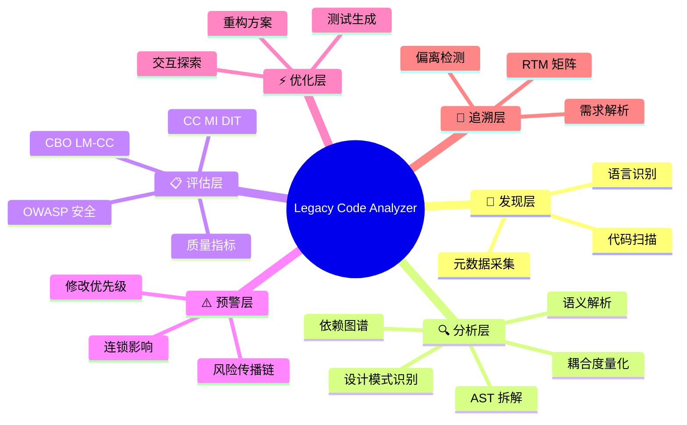

---

## 💡 核心功能

### 8 大分析模块

| # | 模块名称 | 核心功能 | 适用场景 |
|---|---------|---------|---------|
| **1** | **代码元数据与结构分析** | 全量文件扫描、编程语言自动识别、代码规模统计、技术栈推断、语言分布可视化 | 快速了解项目全貌 |
| **2** | **语义解析与设计意图推断** | AST 深度拆解、控制流/数据流分析、设计模式自动识别、临时方案（TODO/FIXME）标记 | 深入理解代码逻辑 |
| **3** | **依赖关系挖掘与耦合度分析** | 显式/隐式依赖提取、Ca/Ce/I/A/D 耦合度量化、循环依赖检测、数据依赖分析 | 模块间关系排查 |
| **4** | **代码质量评估与缺陷检测** | CC/MI/DIT/CBO/LM-CC 五项指标计算、ISO/IEC 5055 缺陷检测、OWASP 安全扫描 | 代码质量量化评估 |
| **5** | **风险预警与修改指导** | 连锁影响分析、修改优先级排序、替代方案推荐、重构任务排期 | 修改风险评估 |
| **6** | **自动化测试与重构辅助** | 正常/边界/异常三类型测试用例生成、重构前后对比方案 | 安全重构 |
| **7** | **交互式代码探索** | 自然语言查询解析、函数功能解释、设计意图咨询、即时风险评估 | 任意代码提问 |
| **8** | **目标性评估与需求覆盖分析** | 需求文本解析、代码对照匹配、偏离检测、RTM 矩阵生成、补全建议 | 需求验收与差距分析 |

### 分析工作流

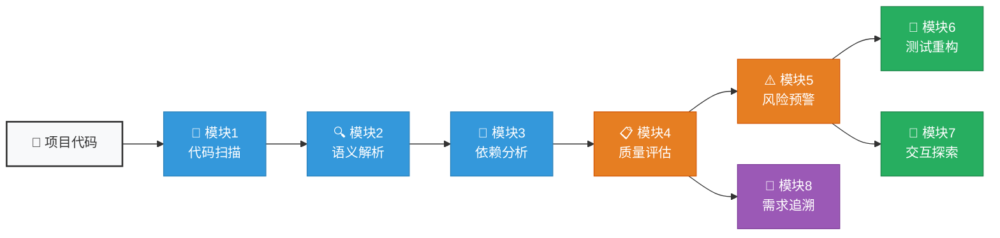

### 功能特性矩阵

```
                          ┌─────┬─────┬─────┬─────┬─────┬─────┬─────┬─────┐
                          │ M1  │ M2  │ M3  │ M4  │ M5  │ M6  │ M7  │ M8  │
┌─────────────────────────┼─────┼─────┼─────┼─────┼─────┼─────┼─────┼─────┤
│ 文件扫描与语言识别       │  ✅ │     │     │     │     │     │     │     │
│ AST 语法树解析           │     │  ✅ │     │     │     │     │     │     │
│ 设计模式检测             │     │  ✅ │     │     │     │     │     │     │
│ 显式/隐式依赖提取        │     │     │  ✅ │     │     │     │     │     │
│ 循环依赖检测             │     │     │  ✅ │     │     │     │     │     │
│ 圈复杂度计算             │     │     │     │  ✅ │     │     │     │     │
│ 可维护性指数 MI          │     │     │     │  ✅ │     │     │     │     │
│ 继承深度 DIT             │     │     │     │  ✅ │     │     │     │     │
│ 类耦合度 CBO             │     │     │     │  ✅ │     │     │     │     │
│ OWASP 安全扫描           │     │     │     │  ✅ │     │     │     │     │
│ 连锁影响分析             │     │     │     │     │  ✅ │     │     │     │
│ 修改优先级排期           │     │     │     │     │  ✅ │     │     │     │
│ 测试用例自动生成         │     │     │     │     │     │  ✅ │     │     │
│ 重构方案规划             │     │     │     │     │     │  ✅ │     │     │
│ 自然语言查询解析         │     │     │     │     │     │     │  ✅ │     │
│ 函数流程图生成           │     │     │     │     │     │     │  ✅ │     │
│ 需求文本解析             │     │     │     │     │     │     │     │  ✅ │
│ 追溯矩阵 RTM            │     │     │     │     │     │     │     │  ✅ │
│ Mermaid 图表输出         │  ✅ │  ✅ │  ✅ │  ✅ │  ✅ │  ✅ │  ✅ │  ✅ │
└─────────────────────────┴─────┴─────┴─────┴─────┴─────┴─────┴─────┴─────┘
```

---

## 🏗️ 产品架构

### 6 层分析架构

本技能采用**六层架构设计**，每一层对应一个分析抽象级别，从数据采集到决策输出层层递进：

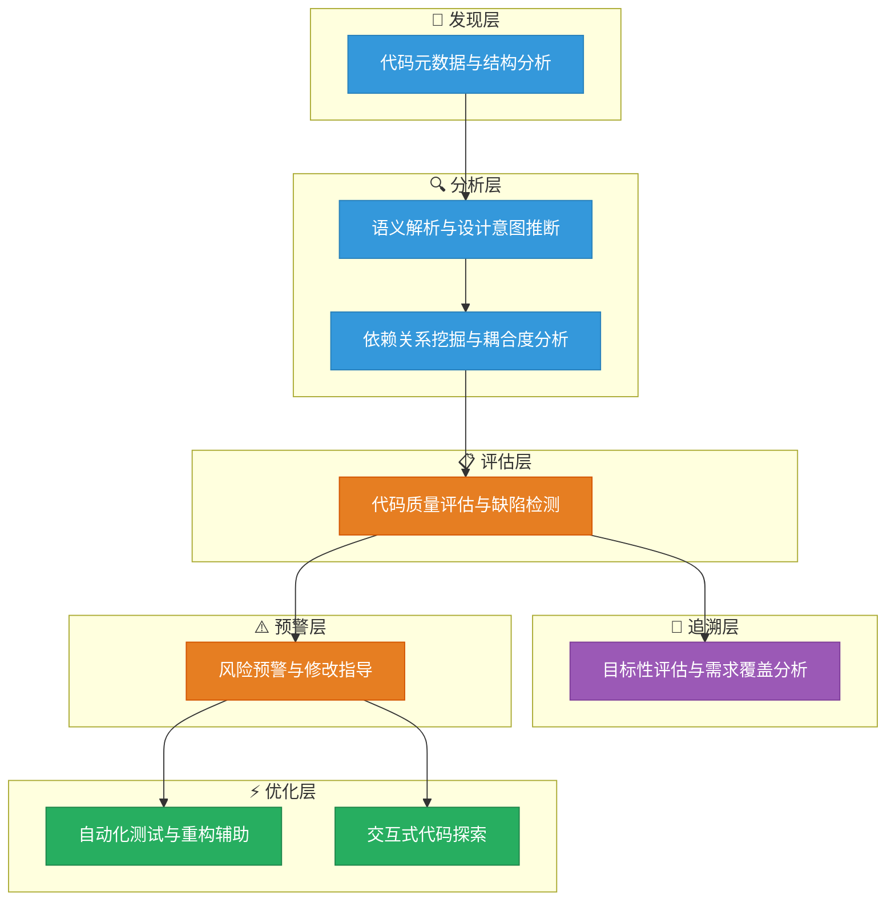

### 模块间数据流向

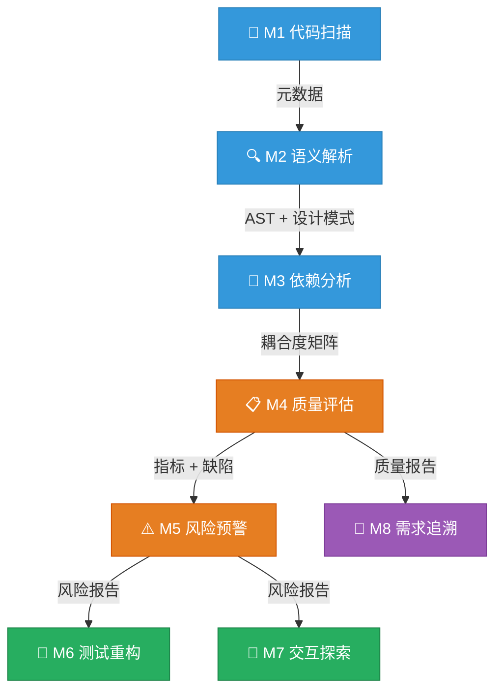

### 六层协同工作原理

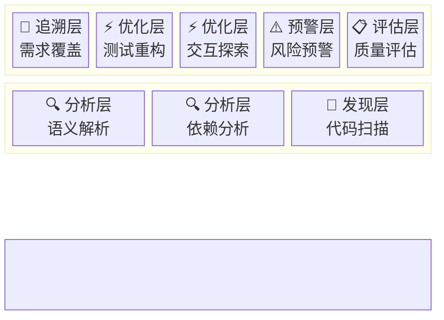

---

## 📊 可视化能力

### 21 种 Mermaid 图表全景

本技能集成了 **21 种 Mermaid 可视化图表**，覆盖 8 种图表类型，构建全方位可视化分析体系：

| # | 图表类型 | 图表用途 | 所属模块 | 配色说明 |
|---|---------|---------|---------|---------|
| 1 | `graph TD` | **分层架构图** — 展示展示层/业务层/数据层架构 | M1 | 🔵 蓝 |
| 2 | `pie` | **语言分布饼图** — 按代码量展示各语言占比 | M1 | 🔵 蓝 |
| 3 | `timeline` | **代码演化时间线** — 基于 Git 提交的演变历史 | M1 | 🔵 蓝 |
| 4 | `flowchart TD` | **5 色函数控制流图** — 展示函数内执行路径 | M2 | 🔵 蓝 |
| 5 | `mindmap` | **设计模式分类树** — 创建型/结构型/行为型 | M2 | 🔵 蓝 |
| 6 | `graph LR` | **依赖拓扑图** — 模块间依赖方向与强度 | M3 | 🔵 蓝 |
| 7 | `xychart-beta` | **耦合度对比柱状图** — 各模块 Ca/Ce 对比 | M3 | 🔵 蓝 |
| 8 | `timeline` | **数据依赖流** — RAW/WAR/WAW 依赖分类 | M3 | 🔵 蓝 |
| 9 | `pie` | **缺陷风险分布饼图** — 高/中/低风险占比 | M4 | 🟠 橙 |
| 10 | `flowchart TD` | **5 维评分雷达图** — CC/MI/DIT/CBO/LM-CC | M4 | 🟠 橙 |
| 11 | `xychart-beta` | **CC/MI 对比柱线图** — 各模块复杂度与可维护性 | M4 | 🟠 橙 |
| 12 | `flowchart LR` | **风险传播链图** — 修改连锁影响扩散路径 | M5 | 🔴 红 |
| 13 | `timeline` | **修改优先级时间线** — P0-P3 四等级优先级 | M5 | 🔴 红 |
| 14 | `gantt` | **重构任务排期甘特图** — 各任务起止时间 | M5 | 🔴 红 |
| 15 | `pie` | **测试覆盖类型饼图** — 单元/集成/边界/异常 | M6 | 🟢 绿 |
| 16 | `flowchart TD` | **重构前后对比图** — 架构变更差异可视化 | M6 | 🟢 绿 |
| 17 | `flowchart LR` | **查询分类决策树** — 7 色查询类型分流决策 | M7 | 🟢 绿 |
| 18 | `flowchart TD` | **4 色函数流程图** — 简洁版函数执行逻辑 | M7 | 🟢 绿 |
| 19 | `mindmap` | **需求分类思维导图** — FR/NFR/BR/CN 分类 | M8 | 🟣 紫 |
| 20 | `pie` | **需求覆盖度饼图** — 实现状态分布比例 | M8 | 🟣 紫 |
| 21 | `flowchart LR` | **追溯工作流图** — 需求匹配到代码的完整流程 | M8 | 🟣 紫 |

### 图表配色规范

所有 Mermaid 图表使用统一的 `classDef` 配色系统，确保视觉一致性：

| 颜色 | 色值 | 用途 | 对应层级 |
|------|------|------|---------|
| 🔵 蓝 | `#3498db` | 发现层 — 扫描、语义、依赖分析 | Module 1-3 |
| 🟠 橙 | `#e67e22` | 分析层 — 质量评估、风险预警 | Module 4-5 |
| 🟢 绿 | `#27ae60` | 建议层 — 测试生成、交互探索 | Module 6-7 |
| 🔴 红 | `#e74c3c` | 风险层 — 错误节点、高危路径 | 异常/风险路径 |
| 🟣 紫 | `#9b59b6` | 目标层 — 需求追溯与验证 | Module 8 |

### 图表类型分布

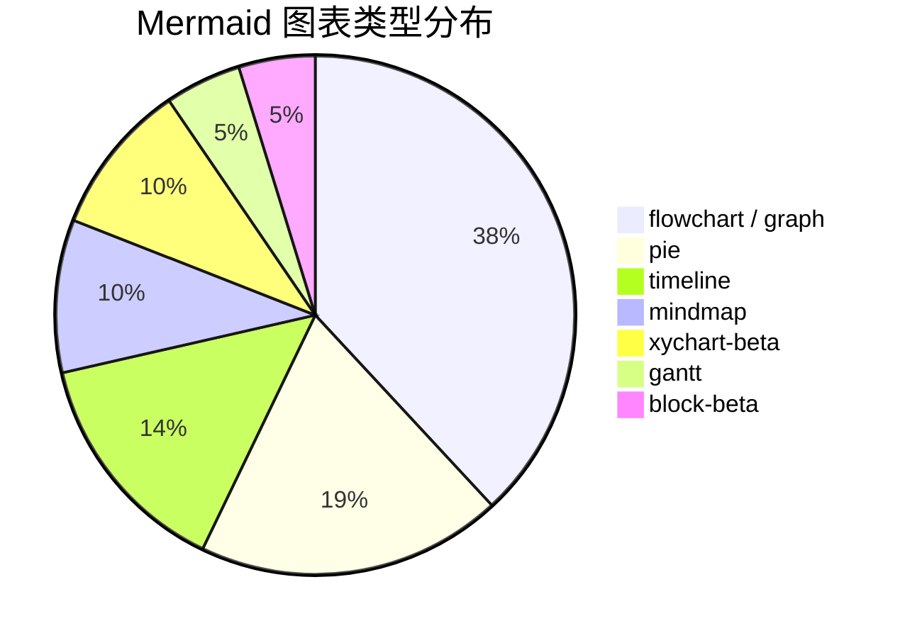

## 🔤 支持的语言

| 语言 | 文件扩展名 | 分析重点 | 分析深度 |
|------|-----------|---------|---------|
| **Python** | `.py`, `.pyx`, `requirements.txt`, `setup.py` | 动态类型、装饰器、生成器、上下文管理器、`__init__` 模式 | ⭐⭐⭐⭐⭐ 完全支持 |
| **Java** | `.java`, `.kt`, `pom.xml`, `build.gradle` | 继承深度、接口设计、Spring 注解、泛型、匿名类 | ⭐⭐⭐⭐⭐ 完全支持 |
| **JavaScript** | `.js`, `.jsx`, `.ts`, `.tsx`, `.vue`, `package.json` | 异步处理（Promise/async）、闭包、原型链、ES6+ 语法 | ⭐⭐⭐⭐⭐ 完全支持 |
| **C++** | `.cpp`, `.cxx`, `.cc`, `.h`, `.hpp`, `CMakeLists.txt` | 内存管理、指针安全、模板元编程、RAII 模式 | ⭐⭐⭐⭐⭐ 完全支持 |
| **C#** | `.cs`, `.csproj`, `.sln` | 委托/事件、LINQ、async/await、泛型约束、属性 | ⭐⭐⭐⭐⭐ 完全支持 |

> 其他语言：基于通用代码特征提供基础分析（文件统计、注释比率、基本依赖检测），并提示"语言支持有限"。

### 语言分析能力分布

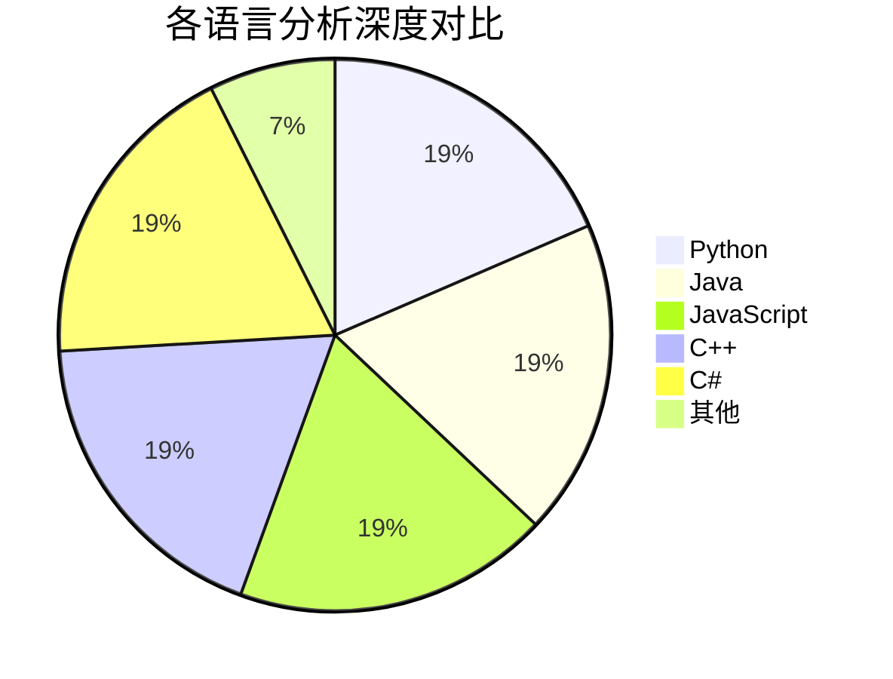

---

## 🚀 快速开始

### 系统要求

- **Python**: 3.8+
- **操作系统**: macOS / Linux / Windows
- **TRAE SOLO**: 2.0+（如使用 TRAE SOLO 集成模式）
- **磁盘空间**: < 10MB

### 30 秒体验

```bash
# 1. 克隆或下载项目
git clone https://github.com/your-username/legacy-code-analyzer.git
cd legacy-code-analyzer

# 2. 运行演示脚本（分析本技能自身的代码）
python3 demo_visual.py

# 3. 查看生成的演示报告
cat demo_visual_report.md
```

### 分析流程概览

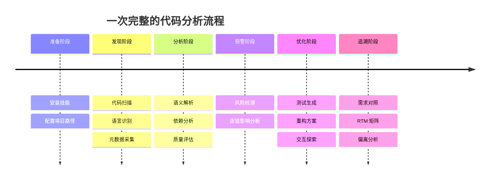

### 自评估运行

```bash
# 用本技能的所有 8 个模块分析自身代码质量
python3 self_evaluate.py

# 查看自评估报告
cat self-evaluation-report.md
```

---

## 🛠️ 在 TRAE SOLO 中使用

### 方式一：上传 ZIP 包安装（推荐）

1. 下载或打包本项目的 ZIP 压缩包：`legacy-code-analyzer-skill.zip`
2. 打开 **TRAE SOLO**
3. 进入 **技能管理** → **导入技能**
4. 选择上传 `legacy-code-analyzer-skill.zip`
5. 上传完成后，技能自动注册到 AI Agent 的工具列表中

### 方式二：手动放置技能目录

```bash
# 将技能目录复制到 TRAE SOLO 的技能加载路径
cp -r legacy-code-analyzer/ /data/user/builtin/code/default/skills/

# 具体路径请参考你的 TRAE SOLO 部署配置
```

确认 `SKILL.md` 的 YAML frontmatter 注册信息正确：

```yaml
---
name: "legacy-code-analyzer"
description: "Legacy Code Analyzer & Optimizer - 针对遗留代码、陌生代码库进行深度分析、可维护性优化与风险预警。覆盖代码理解、评估、优化到验证的全流程。支持 Java, JavaScript, Python, C++, C#。"
version: "1.0.0"
---
```

### 方式三：在对话中直接使用

技能安装成功后，在 TRAE SOLO 对话中描述你的分析需求，技能会自动激活：

<details>
<summary><b>🔍 全面分析一个项目</b> — 点击展开</summary>

> **用户输入**：
> ```
> 请全面分析 /path/to/my-project 这个代码库
> ```
>
> **技能输出**：
> 1. 📐 元数据报告（语言、规模、模块划分、技术栈）
> 2. 🏗️ 分层架构 Mermaid 图
> 3. 📊 语言分布饼图
> 4. 🕐 代码演化时间线
> 5. 🔍 语义分析卡片（设计意图、临时方案标记）
> 6. 🔗 依赖拓扑图 + 耦合度矩阵
> 7. 📋 质量评估 + 缺陷清单
> 8. ⚠️ 风险预警 + 修改优先级
</details>

<details>
<summary><b>🎯 分析特定文件</b> — 点击展开</summary>

> **用户输入**：
> ```
> 帮我看看 src/services/order_service.py 的设计意图和风险
> ```
>
> **技能输出**：
> 1. 📝 功能概述
> 2. 🔍 设计意图推断
> 3. 📊 4 色函数流程图
> 4. ⚠️ 风险标注
</details>

<details>
<summary><b>📊 代码质量检查</b> — 点击展开</summary>

> **用户输入**：
> ```
> 帮我检查 /path/to/project 的代码质量，重点关注安全问题
> ```
>
> **技能输出**：
> 1. 📋 综合可维护性评分
> 2. 📐 CC/MI/DIT/CBO/LM-CC 指标明细
> 3. 📊 CC/MI 对比柱线图
> 4. 🥧 缺陷风险分布饼图
> 5. 🔒 OWASP 安全漏洞清单
> 6. 📏 ISO/IEC 5055 缺陷对照报告
</details>

<details>
<summary><b>🔄 重构前评估</b> — 点击展开</summary>

> **用户输入**：
> ```
> 我打算重构 src/services/ 模块，帮我评估风险和影响范围
> ```
>
> **技能输出**：
> 1. 🔗 目标模块依赖拓扑图
> 2. ⚠️ 风险传播链 Mermaid 图
> 3. 🔗 连锁影响分析（直接 + 传递影响）
> 4. 📅 修改优先级时间线
> 5. 💡 替代方案对比表格
> 6. 📐 重构前后架构对比图
> 7. ✅ 验证检查点清单
</details>

<details>
<summary><b>📋 需求验收</b> — 点击展开</summary>

> **用户输入**：
> ```
> 这是我的需求文档：【粘贴需求】，请对照代码库做目标性评估
> ```
>
> **技能输出**：
> 1. 🧠 需求分类思维导图
> 2. 🥧 需求覆盖度饼图
> 3. 📋 需求追溯矩阵（RTM）
> 4. 📎 代码对应关系（精确到文件:行号）
> 5. ⚠️ 偏离分析
> 6. 📋 缺失功能优先级清单
> 7. 💡 补全建议
</details>

<details>
<summary><b>❓ 理解任意代码</b> — 点击展开</summary>

> **用户输入**：
> ```
> src/utils/auth.py 里的 verify_token 函数是做什么的？为什么这样设计？
> ```
>
> **技能输出**：
> 1. 📝 功能概述
> 2. 📊 4 色函数流程图
> 3. 🔑 关键变量说明
> 4. 💡 设计意图推断
> 5. ⚙️ 约束条件分析
> 6. ⚠️ 风险标注
</details>

### 分析范围选择

技能激活后，AI Agent 会与你确认分析范围，你也可以直接指定：

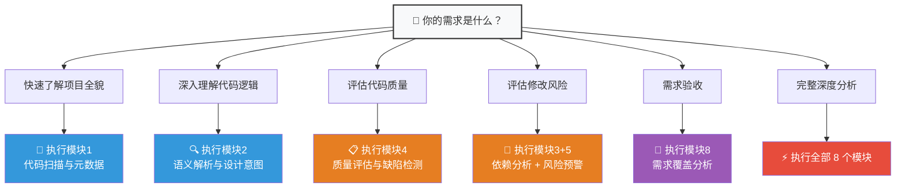

| 分析选项 | 说明 | 执行模块 |
|---------|------|---------|
| **完整分析**（推荐） | 执行全部 8 个模块 | M1 → M2 → M3 → M4 → M5 → M6 → M7 → M8 |
| 仅结构与元数据 | 快速了解项目概览 | M1 |
| 语义解析与设计意图 | 深入理解代码逻辑 | M2 |
| 依赖与耦合度分析 | 排查模块间关系 | M3 |
| 代码质量评估 | 检测缺陷和安全漏洞 | M4 |
| 风险预警与修改指导 | 评估修改风险 | M5 |
| 测试与重构辅助 | 生成测试和重构方案 | M6 |
| 交互式代码探索 | 提出具体问题 | M7 |
| 目标性评估 | 对照需求分析（需提供需求文档） | M8 |

> **提示**：你也可以直接说 — "只做质量评估和风险预警" 或 "做依赖分析就好"

---

## 🐍 Python API 编程使用

本技能的所有模块均可作为 Python 库直接导入调用，适用于 CI/CD 集成、自动化流水线等场景。

### 快速上手

```python
from modules import LegacyCodeAnalyzer

# 初始化分析器
analyzer = LegacyCodeAnalyzer("/path/to/your/project")
```

### 逐步执行单个模块

```python
# 模块 1：代码扫描 → 获取项目元数据
scan_result = analyzer.scan()
print(f"文件数: {scan_result.total_files}")
print(f"总行数: {scan_result.total_lines}")
print(f"语言: {scan_result.languages}")

# 模块 2：语义解析 → 分析代码设计意图
semantic_result = analyzer.analyze_semantics()

# 模块 3：依赖分析 → 构建依赖图
dependency_result = analyzer.analyze_dependencies()

# 模块 4：质量评估 → 计算质量指标
quality_result = analyzer.evaluate_quality()
print(f"综合评分: {quality_result['overall_score']}/10")

# 模块 5：风险预警 → 评估修改风险
risk_result = analyzer.advise_risks()
```

### 一键完整分析

```python
# 不带需求对照的完整分析
report = analyzer.run_full_analysis(generate_markdown=True)

# 带需求对照的完整分析
report = analyzer.run_full_analysis(
    requirements="""
    FR-001: 用户注册功能，支持邮箱验证
    FR-002: 订单创建，含库存校验
    NFR-001: API 响应时间 < 200ms
    """,
    generate_markdown=True,
)
print(report["markdown_report"])  # 包含所有 Mermaid 图表的完整报告
```

### 生成可视化报告

```python
from modules import ReportRenderer

scan = analyzer.scan()
quality = analyzer.evaluate_quality()
risk = analyzer.advise_risks()

renderer = ReportRenderer("My Project")
report_md = renderer.render_full_report(scan, quality, risk)

# 保存为 Markdown 文件
with open("analysis-report.md", "w") as f:
    f.write(report_md)
```

### 便捷函数（一行完成）

```python
from modules import quick_scan, quick_quality, full_analysis

# 快速扫描
scan = quick_scan("/path/to/project")

# 快速质量评估
quality = quick_quality("/path/to/project")

# 完整分析
full = full_analysis("/path/to/project", requirements="...")
```

### 自评估分析

用本技能分析自身代码质量：

```bash
cd legacy-code-analyzer
python3 self_evaluate.py
```

生成 **self-evaluation-report.md**，展示本技能自身的代码质量评分、依赖图、缺陷清单等全部 8 个模块的分析结果。

---

## 📝 输出格式规范

### 分析报告结构

分析报告遵循统一的结构模板，确保每次输出的可读性和一致性：

```markdown
# 📊 分析报告：[项目名]

## 📐 代码元数据报告
[元数据表格 + 分层架构 Mermaid 图 + 语言分布饼图 + 代码演化时间线]

## 🔍 模块语义分析
[语义分析卡片 + 设计模式思维导图 + 函数流程图]

## 🔗 依赖关系分析
[模块耦合度矩阵 + 依赖拓扑图 + 循环依赖检测 + 隐式依赖清单]

## 📋 代码质量评估
[质量评分雷达 + 缺陷清单 + 模块 CC/MI 对比图]

## ⚠️ 风险预警
[风险传播链 + 修改优先级 + 重构方案 + 替代建议]

## 🧪 测试用例与重构方案
[测试用例 + 重构对比图 + 验证清单]

## 🎯 目标性评估（如提供需求）
[需求思维导图 + 覆盖度饼图 + RTM 矩阵 + 偏离分析 + 补全建议]
```

### 代码引用格式

所有代码位置引用使用标准化格式，方便快速定位：

```
文件路径:L行号
src/services/auth.py:45-89
utils/helpers.py:120
```

### 风险等级标识

| 等级 | 标识 | 说明 | 示例 |
|------|------|------|------|
| 高 | 🔴 | 安全漏洞、数据丢失风险、核心功能异常 | SQL 注入、硬编码密钥、空指针解引用 |
| 中 | 🟡 | 潜在缺陷、边界条件遗漏、性能瓶颈 | 资源泄露、未捕获异常、大对象分配 |
| 低 | 🟢 | 代码风格、注释缺失、轻微技术债务 | 过长方法、重复代码、命名不规范 |

---

## 📐 质量度量体系

### 五项核心质量指标

| 指标 | 全称 | 计算方式 | 🟢 优秀 | 🔵 良好 | 🟡 较差 | 🔴 极差 |
|------|------|---------|:-------:|:-------:|:-------:|:-------:|
| **CC** | 圈复杂度 | E − N + 2P | ≤10 | 11-20 | 21-50 | >50 |
| **MI** | 可维护性指数 | 171 − 5.2·ln(V) − 0.23·CC − 16.2·ln(LOC) | >85 | 65-85 | <65 | — |
| **DIT** | 继承深度 | 从根到叶的最大继承层数 | ≤3 | 4-5 | 6-7 | >7 |
| **CBO** | 类耦合度 | 与本类耦合的其他类数量 | ≤7 | 8-14 | 15-20 | >20 |
| **LM-CC** | 逻辑模块复杂度 | 考虑模块边界的 CC 调整值 | ≤10 | 11-15 | 16-25 | >25 |

### 质量指标阈值可视化

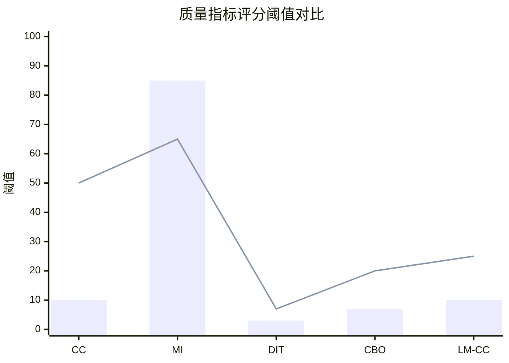

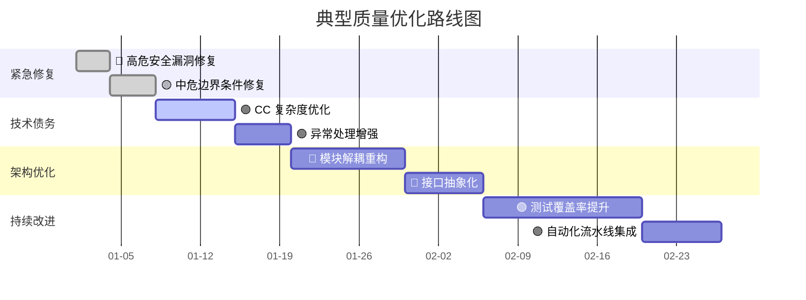

### 缺陷检测标准

#### ISO/IEC 5055:2021

软件产品质量度量国际标准，涵盖以下缺陷类别：

- **语法错误** — 不可编译/解析的代码
- **逻辑漏洞** — 条件判断遗漏、死代码、无限循环
- **异常处理缺失** — 未捕获检查型异常、资源未释放
- **边界条件遗漏** — 数组越界、空值判断缺失、数值溢出
- **过期依赖** — 已弃用的 API 调用、过时的库引用
- **冗余代码** — 不可达代码、重复代码块、无用导入

#### OWASP Top 10:2021

Web 安全漏洞分类标准：

| 编号 | 漏洞类别 | 检测重点 |
|:----:|---------|---------|
| A01 | 失效的访问控制 | 未授权访问、权限提升 |
| A02 | 加密机制失效 | 明文密码、弱加密算法 |
| A03 | 注入 | SQL 注入、命令注入、XPath 注入 |
| A04 | 不安全设计 | 缺乏速率限制、不安全的默认配置 |
| A05 | 安全配置错误 | 调试模式开启、默认凭据 |
| A06 | 易受攻击的组件 | 已知漏洞的依赖库 |
| A07 | 认证和识别失败 | 弱密码策略、会话固定 |
| A08 | 数据完整性失败 | 反序列化漏洞、不安全的更新机制 |
| A09 | 安全日志和监控不足 | 缺乏审计日志、错误信息泄露 |
| A10 | 服务端请求伪造 | SSRF、URL 重定向 |

### 依赖耦合度指标

| 指标 | 含义 | 范围 | 说明 |
|------|------|:----:|------|
| **Ca** (Afferent) | 被依赖数 — 有多少模块依赖本模块 | ≥0 | Ca 越高，本模块越"核心" |
| **Ce** (Efferent) | 依赖数 — 本模块依赖多少其他模块 | ≥0 | Ce 越高，本模块越"脆弱" |
| **I** (Instability) | 不稳定性 = Ce / (Ca + Ce) | 0~1 | 0 表示完全稳定，1 表示完全不稳定 |
| **A** (Abstractness) | 抽象度 = 抽象类/接口占比 | 0~1 | 0 表示完全具体，1 表示完全抽象 |
| **D** (Distance) | 距主序列距离 = \|A + I − 1\| | 0~1 | **越小越好**，接近 0 表示设计平衡 |

---

## 💼 典型使用场景

### 场景 1：接手陌生代码库

> **用户**："我刚接手这个项目，帮我全面分析一下 /path/to/project"
>
> **技能输出**：
> 1. 📐 元数据报告（语言分布、代码规模、技术栈）
> 2. 🏗️ 3 层架构 Mermaid 图
> 3. 📊 语言分布饼图
> 4. 🔍 各模块语义分析卡片
> 5. 🔗 依赖拓扑图 + 耦合度矩阵
> 6. 📋 质量评估 + 缺陷清单
> 7. ⚠️ 风险预警 + 修改优先级

### 场景 2：代码质量审计

> **用户**："帮我检查 /path/to/project 的代码质量，重点关注安全问题"
>
> **技能输出**：
> 1. 📋 综合可维护性评分（满分 10）
> 2. 📐 各模块 CC/MI/DIT/CBO/LM-CC 明细
> 3. 📊 CC/MI 对比柱线图
> 4. 🥧 缺陷风险等级分布饼图
> 5. 🔒 OWASP 安全漏洞清单（含修复建议）
> 6. 📏 ISO/IEC 5055 缺陷对照报告

### 场景 3：重构前风险评估

> **用户**："我打算重构 src/services/ 模块，帮我评估风险和影响范围"
>
> **技能输出**：
> 1. 🔗 目标模块的完整依赖拓扑
> 2. ⚠️ 风险传播链 Mermaid 图
> 3. 🔗 连锁影响分析（直接 + 传递依赖）
> 4. 📅 修改优先级时间线（P0-P3）
> 5. 💡 替代实现方案对比
> 6. 📐 重构前后架构对比图
> 7. ✅ 功能一致性验证检查点清单

### 场景 4：需求验收与差距分析

> **用户**："这是我的需求文档：【粘贴】，帮我看看代码实现了多少"
>
> **技能输出**：
> 1. 🧠 需求分类思维导图（FR/NFR/BR/CN）
> 2. 🥧 需求覆盖度饼图
> 3. 📋 需求追溯矩阵（RTM）含状态图标
> 4. 📎 需求-代码对应关系（精确到文件:行号）
> 5. ⚠️ 偏离分析（实现差异标注）
> 6. 📋 缺失功能优先级清单
> 7. 💡 补全建议

### 场景 5：理解陌生函数

> **用户**："src/utils/auth.py 里的 verify_token 函数是做什么的？为什么这样设计？"
>
> **技能输出**：
> 1. 📝 功能概述（2-3 句话）
> 2. 📊 4 色 Mermaid 函数流程图
> 3. 🔑 关键变量与数据结构说明
> 4. 💡 设计意图推断（为什么选择这种实现）
> 5. ⚙️ 约束条件分析
> 6. ⚠️ 风险标注（如有）

### 场景 6：CI/CD 集成

```python
# 在 CI 流水线中自动分析代码质量
from modules import quick_scan, quick_quality

scan = quick_scan(".")
quality = quick_quality(".")

score = quality["overall_score"]
defects_count = len(quality["all_defects"])

if score < 5.0:
    print(f"❌ 质量评分 {score}/10 低于阈值，构建失败")
    exit(1)
elif defects_count > 0:
    print(f"⚠️ 发现 {defects_count} 个缺陷，请检查报告")
else:
    print(f"✅ 质量评分 {score}/10，通过")
```

---

## 🧩 模块 API 参考

### LegacyCodeAnalyzer 类

| 方法 | 参数 | 返回值 | 说明 |
|------|------|--------|------|
| `scan()` | — | `ModuleScanResult` | 执行模块 1：代码扫描与元数据采集 |
| `analyze_semantics()` | — | `dict` | 执行模块 2：语义解析与设计意图推断 |
| `analyze_dependencies()` | — | `dict` | 执行模块 3：依赖分析与耦合度计算 |
| `evaluate_quality()` | — | `dict` | 执行模块 4：质量评估与缺陷检测 |
| `advise_risks()` | `defect_dicts=None` | `dict` | 执行模块 5：风险预警与修改指导 |
| `generate_tests(target_file)` | `str` | `dict` | 执行模块 6：测试用例生成 |
| `explore(query, ...)` | `str` | `str` | 执行模块 7：交互式代码探索 |
| `trace_requirements(text)` | `str` | `dict` | 执行模块 8：需求覆盖分析 |
| `run_full_analysis(requirements, generate_markdown)` | `str, bool` | `dict` | 一键完整分析（1→8） |

### ReportRenderer 类

| 方法 | 说明 |
|------|------|
| `render_full_report()` | 生成完整 Markdown 报告（含全部 Mermaid 图表） |
| `render_scan_section()` | 仅生成扫描部分报告 |
| `render_quality_section()` | 仅生成质量评估部分报告 |
| `render_risk_section()` | 仅生成风险预警部分报告 |

### 独立模块入口函数

| 函数 | 来源模块 | 说明 |
|------|---------|------|
| `scan_project(root_path)` | `scanner.py` | 全量扫描项目目录 |
| `analyze_semantics(project_root, target_files)` | `semantic_analyzer.py` | 语义分析入口 |
| `analyze_dependencies(project_root)` | `dependency_analyzer.py` | 依赖分析入口 |
| `evaluate_quality(project_root)` | `quality_evaluator.py` | 质量评估入口 |
| `generate_risk_advice(project_root)` | `risk_advisor.py` | 风险预警入口 |
| `generate_tests(project_root, target_file)` | `test_generator.py` | 测试生成入口 |
| `explore_code(project_root, query, ...)` | `interactive_explorer.py` | 交互探索入口 |
| `trace_requirements(project_root, requirements_text)` | `requirement_tracer.py` | 需求追溯入口 |
| `identify_language(file_path)` | `shared.py` | 语言识别工具函数 |

---

## ❓ 常见问题 FAQ

<details>
<summary><b>Q1: 这个 Skill 和 ChatGPT 等代码分析工具有什么区别？</b></summary>

本技能不是通用 AI 对话工具，而是**专为 TRAE SOLO 平台设计的结构化分析系统**。区别在于：

1. **标准化输出**：所有结果按固定结构输出，包含量化的质量指标和可视化图表
2. **国际标准对标**：缺陷检测参照 ISO/IEC 5055:2021 和 OWASP Top 10
3. **8 模块解耦**：可按需选择分析深度，从快速概览到全链路深度分析
4. **本地执行**：所有分析在本地完成，代码不会离开你的机器
</details>

<details>
<summary><b>Q2: 技能会修改我的代码吗？</b></summary>

**绝对不会。** 本技能的设计原则之一是"只读不写"。技能内部所有的 `open()` 调用都以 `'r'`（只读）模式打开文件，不会对任何源文件执行写操作。
</details>

<details>
<summary><b>Q3: 为什么选择 Mermaid 而不是其他可视化方案？</b></summary>

1. **纯文本定义**：Mermaid 图表使用纯文本标记语言定义，无需二进制图形文件
2. **Markdown 原生兼容**：大多数 Markdown 渲染器（GitHub、GitLab、Typora 等）原生支持 Mermaid
3. **版本控制友好**：图表定义可以像代码一样纳入 Git 版本管理
4. **TRAE SOLO 原生支持**：TRAE SOLO 平台对 Mermaid 图表有完善的渲染支持
</details>

<details>
<summary><b>Q4: 为什么分析结果中缺陷数是 0？</b></summary>

可能的原因：

1. **代码质量确实很好**（小概率）— 可以查看质量评分来确认
2. **项目规模太小** — 部分检测规则需要一定的代码量才能触发
3. **语言识别不匹配** — 检查识别到的语言类型是否正确
4. **路径问题** — 确保分析器指向了正确的项目根目录

如果确认存在代码问题但未检测到，可以在 GitHub 上提交 issue 描述具体场景。
</details>

<details>
<summary><b>Q5: 大型项目分析性能如何？</b></summary>

对于大型项目（>10 万行代码）：

- **完整分析**可能需要几分钟（取决于文件数量和项目结构）
- **建议策略**：先执行模块 1（快速概览），再根据需要单独执行特定模块
- 所有扫描使用线程池并行处理，充分利用多核 CPU
</details>

<details>
<summary><b>Q6: 如何判断分析结果的质量？</b></summary>

本技能提供了自我评估能力：

```bash
python3 self_evaluate.py
```

这会用本技能的全部 8 个模块分析自身代码，生成自我评估报告。报告中会显示本技能的综合质量评分、缺陷数等指标。
</details>

<details>
<summary><b>Q7: 可以添加新的编程语言支持吗？</b></summary>

本技能的核心 AST 解析使用 Python 内置的 `ast` 模块（Python 语言）+ 正则表达式回退方案。如需添加新语言：

1. 在 `shared.py` 的 `Language` 枚举中添加新语言类型
2. 在 `LANGUAGE_SIGNATURES` 字典中添加文件识别签名
3. 各分析模块会基于通用模式提供基础分析支持
</details>

---

## ⚠️ 注意事项

1. **🔒 只读不写** — 本技能仅读取和分析代码，绝不修改任何源文件
2. **🏠 本地执行** — 所有分析在本地完成，代码不会上传到外部服务
3. **⏱️ 性能说明** — 大型项目（>10 万行）的分析可能需要较长时间，建议分模块执行
4. **🌐 语言覆盖** — 非 Python/Java/JavaScript/C++/C# 的语言仅提供基础分析
5. **💡 启发式推断** — 设计意图推断基于代码结构和命名约定的启发式规则，建议结合人工确认
6. **📊 图表渲染** — Mermaid 图表在部分 Markdown 预览器中可能不完整，建议使用支持 Mermaid 的编辑器

---

## 📚 参考标准

| 标准/工具 | 用途 | 说明 |
|-----------|------|------|
| **ISO/IEC 5055:2021** | 软件质量度量 | 缺陷检测的基准标准 |
| **OWASP Top 10:2021** | Web 安全分类 | 安全漏洞检测依据 |
| **McCabe 圈复杂度** | 复杂度度量 | 可维护性评分核心指标 |
| **Halstead 复杂度** | 体积度量 | MI 可维护性指数计算 |
| **tree-sitter** | AST 解析 | 多语言语法树构建（可选） |
| **jieba** | 中文分词 | 中文 NLP 预处理（可选） |
| **Mermaid** | 图表渲染 | 8 种图表类型可视化 |

---

## 📦 打包部署

```bash
# 方式一：使用导出脚本
cd /path/to/legacy-code-analyzer
python3 export_skill.py

# 方式二：手动打包
cd ..
zip -r legacy-code-analyzer-skill.zip legacy-code-analyzer/ \
  -x "legacy-code-analyzer/__pycache__/*" "*.pyc"
```

---

## 📄 版本历史

| 版本 | 日期 | 变更内容 |
|------|------|---------|
| **1.0.0** | 2025-Q2 | 首次发布。8 大分析模块、21 种 Mermaid 图表、ISO/IEC 5055 + OWASP 检测、Python API、TRAE SOLO 集成 |

---

## 📄 开源协议

本项目基于 **MIT 协议** 开源。代码分析结果仅供参考，不构成任何形式的质量保证或安全承诺。

---

<p align="center">
  <b>Legacy Code Analyzer & Optimizer</b><br>
  <i>让每一行遗留代码都变得可理解、可评估、可优化</i>
</p>
