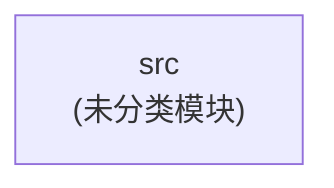
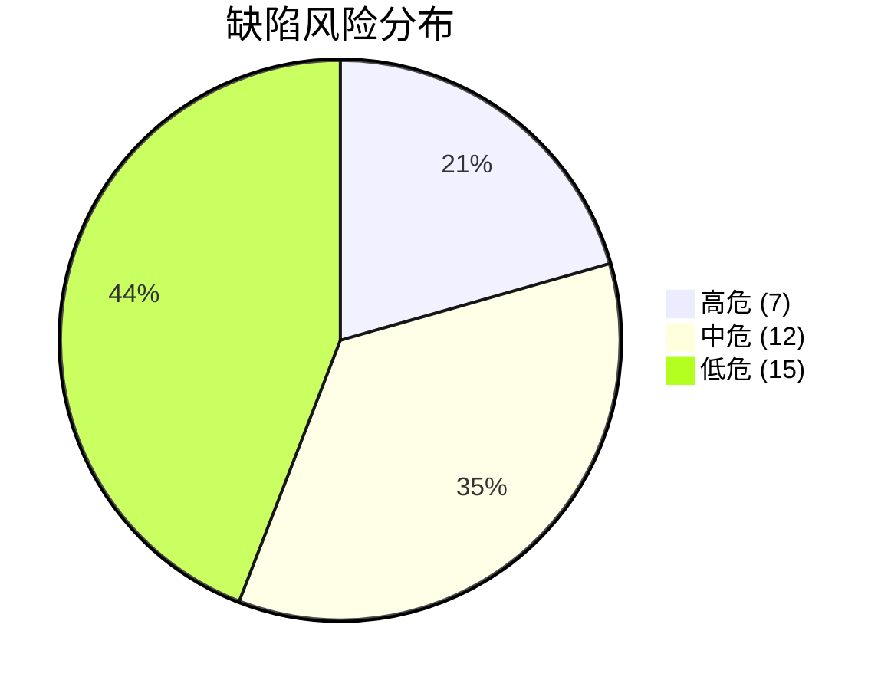
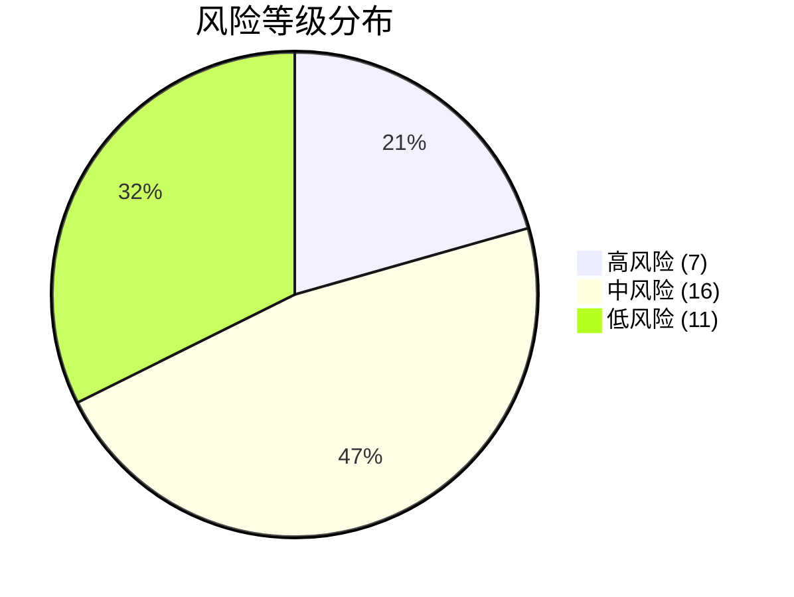
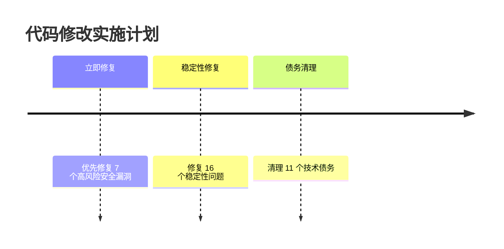
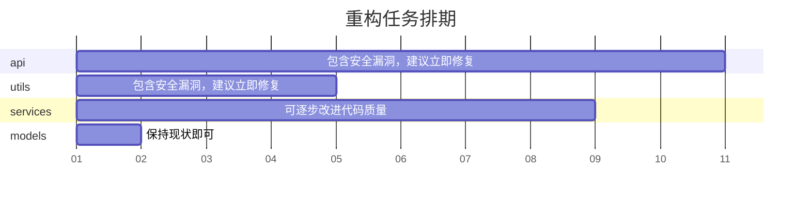

# Legacy Code Analyzer - 可视化分析报告

**项目名称**: Demo Project
**生成时间**: 2026-05-30 08:10:58
**分析引擎**: Legacy Code Analyzer v2.0

> 本报告由 Legacy Code Analyzer 全流程分析自动生成，涵盖代码扫描、质量评估、风险预警三大阶段，并包含多种 Mermaid 可视化图表。


---

## 项目概览

| 指标 | 数值 |
|------|------|
| 总文件数 | 4 |
| 总代码行数 | 279 |
| 总注释行数 | 43 |
| 注释比例 | 11.1% |
| 函数/方法总数 | 14 |
| 类总数 | 1 |
| 语言分布 | PYTHON: 4 files |
| 模块数量 | 1 |

### 项目目录结构

```
demo-project/
├── src/  [未分类模块]
│   ├── src/api/routes.py
│   ├── src/models/user.py
│   ├── src/services/order_service.py
│   ├── src/utils/config.py
```


---

## 技术栈

| 类别 | 技术 |
|------|------|
| language | Python |
| framework | Flask |
| orm | SQLAlchemy |


---

## 模块依赖关系图

下图展示了项目各模块之间的依赖关系，帮助理解架构耦合度：




---

## 代码质量评估

**综合评分**: 8.5 / 10

### 模块质量报告

| 模块 | 平均圈复杂度 | 可维护性指数 | 最大继承深度 | 平均耦合度 | 综合评分 | 评级 |
|------|------------|------------|------------|----------|--------|------|
| models | 1.0 | 100.0 | 1 | 0.0 | 9.5 | 🟢 优秀 |
| api | 2.0 | 78.3 | 0 | 0.0 | 7.7 | 🟡 良好 |
| utils | 1.0 | 100.0 | 0 | 0.0 | 9.8 | 🟢 优秀 |
| services | 8.6 | 62.5 | 0 | 0.0 | 6.9 | 🟡 良好 |


### 待处理缺陷

| 风险等级 | 数量 |
|---------|------|
| 🔴 高危 | 7 |
| 🟡 中危 | 12 |
| 🟢 低危 | 15 |


---

## 缺陷分布饼图




---

## 缺陷详情

| # | 类型 | 位置 | 描述 |
|---|------|------|------|
| 1 | 🟢 logic_flaw | /workspace/demo-project/src/models/user.py:38 | if 语句缺少 else 分支处理 |
| 2 | 🟢 redundant_code | /workspace/demo-project/src/models/user.py:44 | 注释掉的代码: # def |
| 3 | 🟢 redundant_code | /workspace/demo-project/src/models/user.py:46 | 注释掉的代码: #    if |
| 4 | 🟢 redundant_code | /workspace/demo-project/src/models/user.py:49 | 注释掉的代码: #    return |
| 5 | 🟢 logic_flaw | /workspace/demo-project/src/api/routes.py:42 | if 语句缺少 else 分支处理 |
| 6 | 🟡 boundary_coverage | /workspace/demo-project/src/api/routes.py:10 | 除法运算缺少除零检查（除数: data） |
| 7 | 🟡 boundary_coverage | /workspace/demo-project/src/api/routes.py:18 | 除法运算缺少除零检查（除数: users） |
| 8 | 🟡 boundary_coverage | /workspace/demo-project/src/api/routes.py:32 | 除法运算缺少除零检查（除数: users） |
| 9 | 🟡 boundary_coverage | /workspace/demo-project/src/api/routes.py:49 | 除法运算缺少除零检查（除数: orders） |
| 10 | 🟡 boundary_coverage | /workspace/demo-project/src/api/routes.py:89 | 除法运算缺少除零检查（除数: login） |
| 11 | 🟢 redundant_code | /workspace/demo-project/src/api/routes.py:90 | 注释掉的代码: # def |
| 12 | 🟢 redundant_code | /workspace/demo-project/src/api/routes.py:92 | 注释掉的代码: #    if |
| 13 | 🟢 redundant_code | /workspace/demo-project/src/api/routes.py:93 | 注释掉的代码: #        return |
| 14 | 🟢 redundant_code | /workspace/demo-project/src/api/routes.py:94 | 注释掉的代码: #    return |
| 15 | 🔴 security_vulnerability | /workspace/demo-project/src/api/routes.py:18 | [A01:2021-Broken Access Control] 缺少 @login_required 装饰器的路由 |

*仅显示前 15 条缺陷，共 34 条*


---

## 风险评估摘要

| 指标 | 数值 |
|------|------|
| 风险总数 | 34 |
| 🔴 高风险 | 7 |
| 🟡 中风险 | 16 |
| 🟢 低风险 | 11 |

### 风险分布




---

## 重构优先级列表

| 优先级 | 模块 | 优先级评分 | 高风险数 | 中风险数 | 质量评分 | 建议 |
|--------|------|-----------|---------|---------|--------|------|
| 1 | api | 603.0 | 4 | 6 | 7.7 | 🔴 紧急：包含安全漏洞，建议立即修复 |
| 2 | utils | 332.0 | 3 | 1 | 9.8 | 🔴 紧急：包含安全漏洞，建议立即修复 |
| 3 | services | 271.0 | 0 | 8 | 6.9 | 🟢 优化：可逐步改进代码质量 |
| 4 | models | 35.0 | 0 | 1 | 9.5 | ✅ 良好：保持现状即可 |


---

## 修改实施时间线



### 注意事项

    - 每次修改前创建代码备份或 Git commit
    - 每次修改后运行回归测试
    - 高风险修改先在隔离环境验证
    - 修改涉及接口变更时，通知所有依赖方
    - 避免同时修改多个高风险区域
    - 保留原始代码注释记录修改原因


---

## 重构计划甘特图




---

## 总结与建议

**综合评分**: 8.5 / 10
**总风险项**: 34
**高风险项**: 7

**结论**: 🟡 项目存在较多技术债务，建议纳入重构计划

### 推荐操作

1. 优先修复所有高风险缺陷（安全漏洞和稳定性问题）
2. 按照重构优先级列表依次优化各模块
3. 持续监控代码质量指标，防止技术债务积累
4. 建立代码审查制度，确保新代码符合质量标准

---

*报告由 Legacy Code Analyzer 自动生成 | 2026-05-30 08:10:58*
