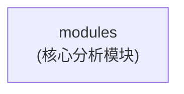
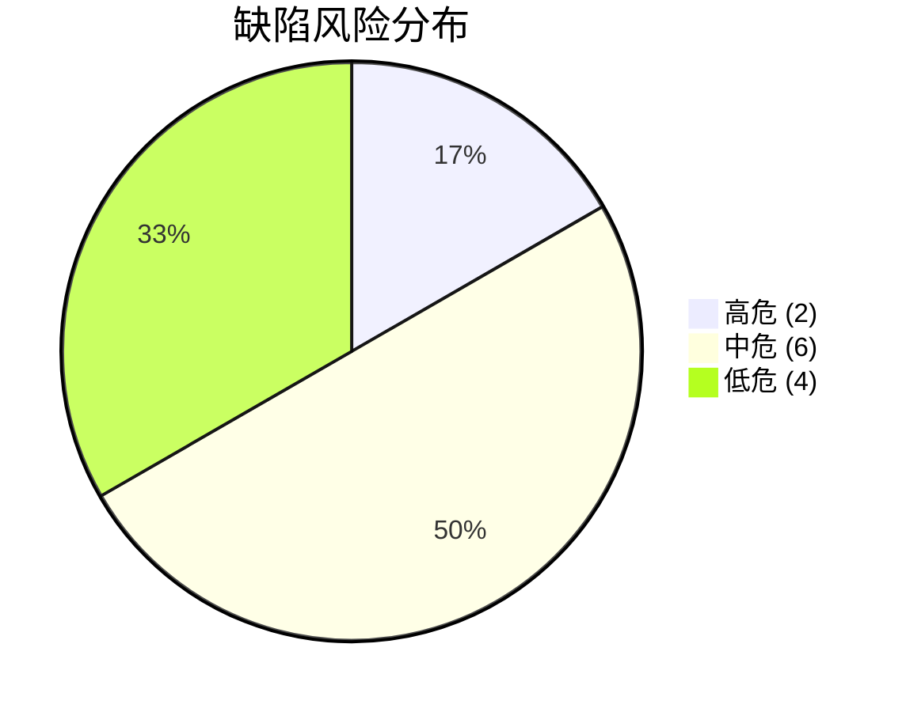
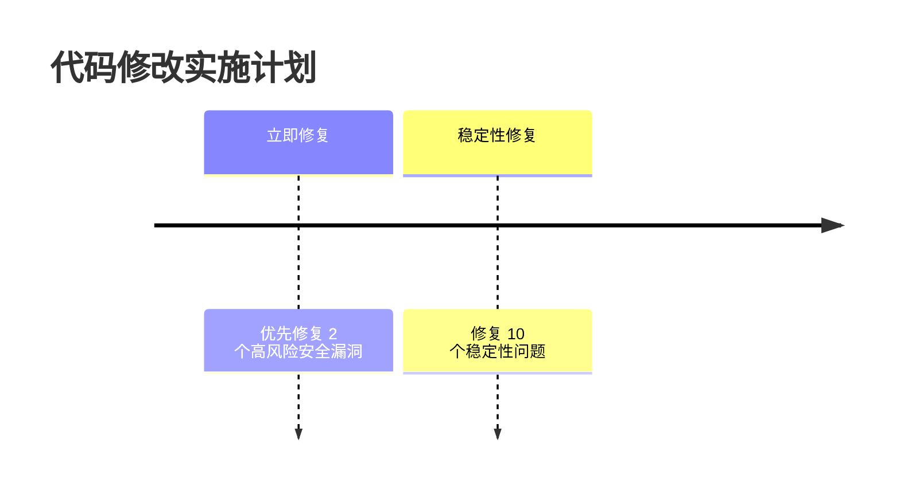
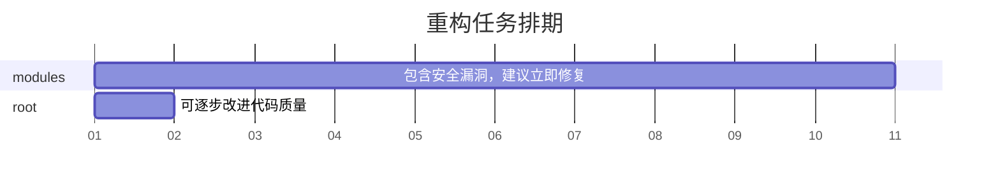
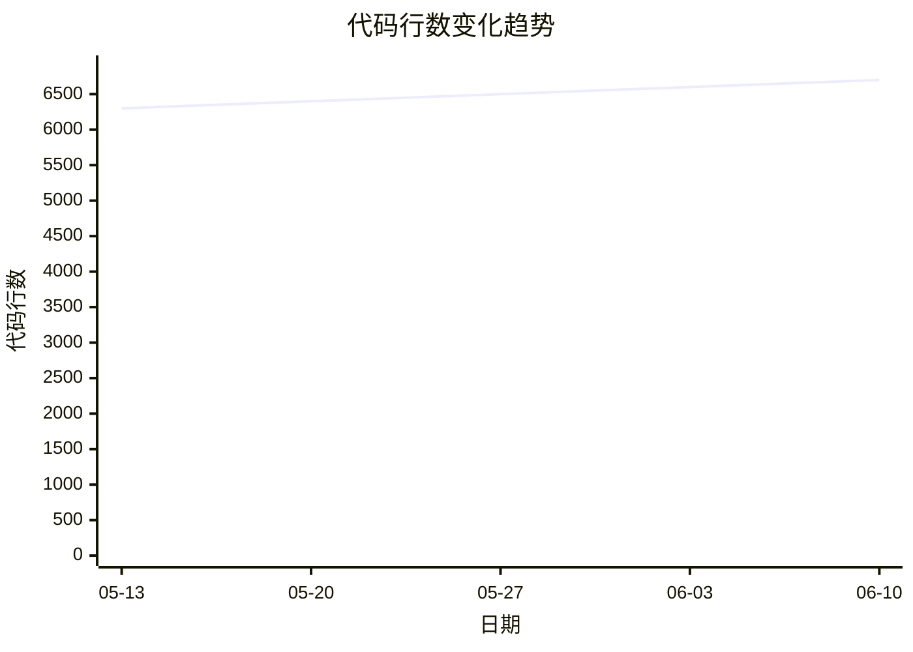
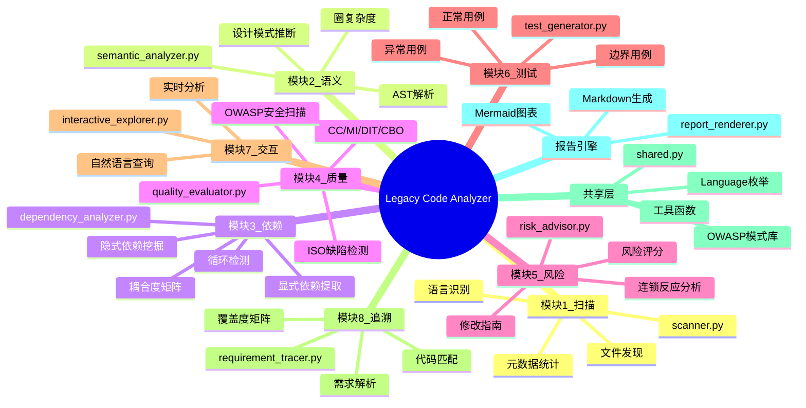
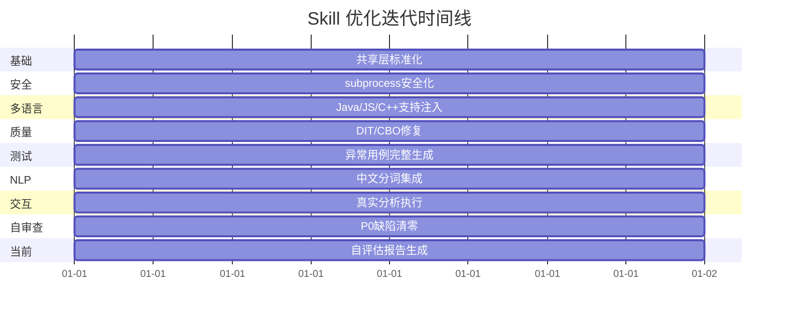
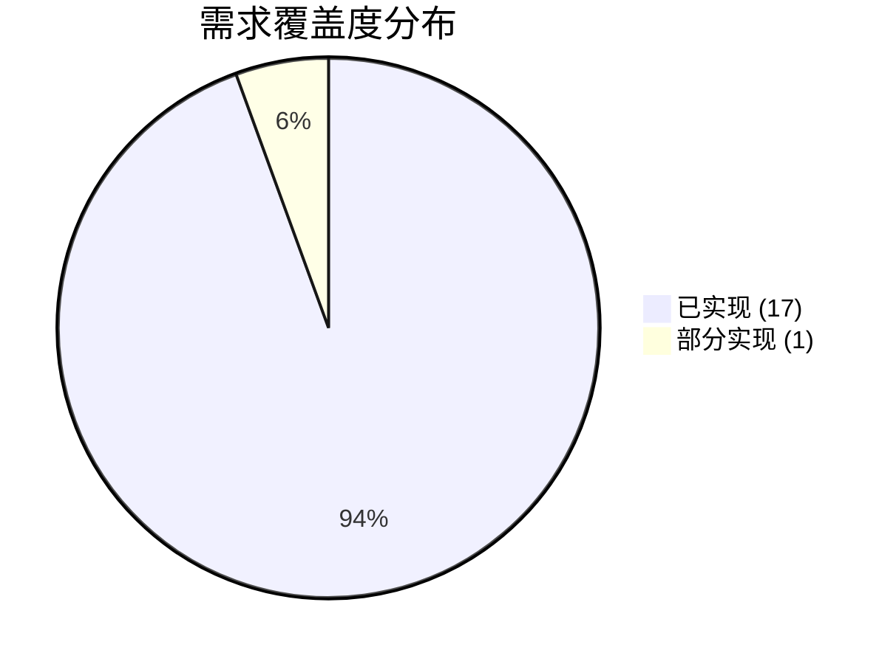
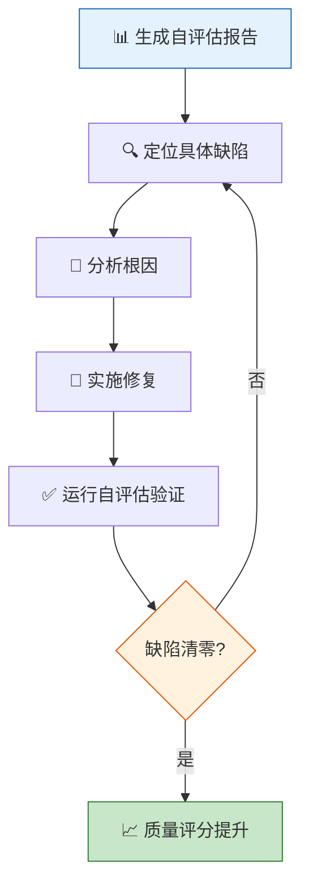
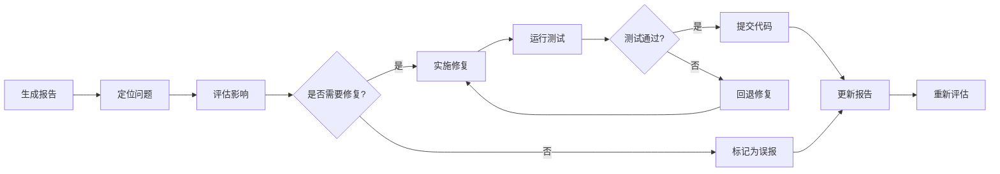

# Legacy Code Analyzer - 可视化分析报告

**项目名称**: Legacy Code Analyzer (Self-Evaluation)
**生成时间**: 2026-06-10 12:06:09
**分析引擎**: Legacy Code Analyzer v2.0

> 本报告由 Legacy Code Analyzer 全流程分析自动生成，涵盖代码扫描、质量评估、风险预警三大阶段，并包含多种 Mermaid 可视化图表。


---

## 项目概览

| 指标 | 数值 |
|------|------|
| 总文件数 | 14 |
| 总代码行数 | 6700 |
| 总注释行数 | 395 |
| 注释比例 | 4.8% |
| 函数/方法总数 | 185 |
| 类总数 | 57 |
| 语言分布 | PYTHON: 14 files |
| 模块数量 | 1 |

### 项目目录结构

```
legacy-code-analyzer/
├── modules/  [核心分析模块]
│   ├── modules/__init__.py
│   ├── modules/dependency_analyzer.py
│   ├── modules/interactive_explorer.py
│   ├── modules/quality_evaluator.py
│   ├── modules/report_renderer.py
│   ├── modules/requirement_tracer.py
│   ├── modules/risk_advisor.py
│   ├── modules/scanner.py
│   ├── modules/semantic_analyzer.py
│   ├── modules/shared.py
│   ├── modules/test_generator.py
```


---

## 技术栈

| 类别 | 技术 |
|------|------|
| language | Python |
| runtime | CPython 3.x |


---

## 模块依赖关系图

下图展示了项目各模块之间的依赖关系，帮助理解架构耦合度：




---

## 代码质量评估

**综合评分**: 5.6 / 10

### 模块质量报告

| 模块 | 平均圈复杂度 | 可维护性指数 | 最大继承深度 | 平均耦合度 | 综合评分 | 评级 |
|------|------------|------------|------------|----------|--------|------|
| root | 8.5 | 58.5 | 0 | 0.0 | 6.7 | 🟡 良好 |
| modules | 34.7 | 45.3 | 1 | 0.8 | 4.5 | 🟠 一般 |


### 待处理缺陷

| 风险等级 | 数量 |
|---------|------|
| 🔴 高危 | 2 |
| 🟡 中危 | 6 |
| 🟢 低危 | 4 |


---

## 缺陷分布饼图



---

## 缺陷详情

| # | 类型 | 位置 | 描述 |
|---|------|------|------|
| 1 | 🟡 missing_exception | /workspace/legacy-code-analyzer/modules/test_generator.py:219 | 空异常捕获块（except: pass），异常被静默忽略 |
| 2 | 🟡 missing_exception | /workspace/legacy-code-analyzer/modules/test_generator.py:231 | 空异常捕获块（except: pass），异常被静默忽略 |
| 3 | 🔴 security_vulnerability | /workspace/legacy-code-analyzer/modules/test_generator.py:219 | [A09:2021-Logging Failures] 宽泛 Exception 被静默吞掉 |
| 4 | 🔴 security_vulnerability | /workspace/legacy-code-analyzer/modules/test_generator.py:231 | [A09:2021-Logging Failures] 宽泛 Exception 被静默吞掉 |
| 5 | 🟡 missing_exception | /workspace/legacy-code-analyzer/modules/scanner.py:593 | 空异常捕获块（except: pass），异常被静默忽略 |
| 6 | 🟡 missing_exception | /workspace/legacy-code-analyzer/modules/scanner.py:618 | 空异常捕获块（except: pass），异常被静默忽略 |
| 7 | 🟡 missing_exception | /workspace/legacy-code-analyzer/modules/scanner.py:670 | 空异常捕获块（except: pass），异常被静默忽略 |
| 8 | 🟡 missing_exception | /workspace/legacy-code-analyzer/modules/scanner.py:679 | 空异常捕获块（except: pass），异常被静默忽略 |
| 9 | 🟢 missing_exception | /workspace/legacy-code-analyzer/modules/scanner.py:733 | 使用了过于宽泛的 Exception 捕获 |
| 10 | 🟢 boundary_coverage | /workspace/legacy-code-analyzer/modules/scanner.py:591 | 索引访问 `file_churn[file_path]` 缺少边界检查 |
| 11 | 🟢 boundary_coverage | /workspace/legacy-code-analyzer/modules/scanner.py:592 | 索引访问 `file_churn[file_path]` 缺少边界检查 |
| 12 | 🟢 boundary_coverage | /workspace/legacy-code-analyzer/modules/quality_evaluator.py:160 | 索引访问 `thresholds[key]` 缺少边界检查 |


---

### 风险分布


---

## 重构优先级列表

| 优先级 | 模块 | 优先级评分 | 高风险数 | 中风险数 | 质量评分 | 建议 |
|--------|------|-----------|---------|---------|--------|------|
| 1 | modules | 555.0 | 2 | 10 | 4.5 | 🔴 紧急：包含安全漏洞，建议立即修复 |
| 2 | root | 33.0 | 0 | 0 | 6.7 | 🟢 优化：可逐步改进代码质量 |


---

## 修改实施时间线



### 注意事项

    - 每次修改前创建代码备份或 Git commit
    - 每次修改后运行回归测试
    - 高风险修改先在隔离环境验证
    - 修改涉及接口变更时，通知所有依赖方
    - 避免同时修改多个高风险区域
    - 保留原始代码注释记录修改原因


---

## 重构计划甘特图




---


## 📈 代码规模演变趋势



*代码行数趋势基于 Git 提交历史（最近 5 次）*


---

## 总结与建议

**综合评分**: 5.6 / 10
**总风险项**: 12
**高风险项**: 2

**结论**: 🟡 项目存在较多技术债务，建议纳入重构计划

### 推荐操作

1. 优先修复所有高风险缺陷（安全漏洞和稳定性问题）
2. 按照重构优先级列表依次优化各模块
3. 持续监控代码质量指标，防止技术债务积累
4. 建立代码审查制度，确保新代码符合质量标准

---

*报告由 Legacy Code Analyzer 自动生成 | 2026-06-10 12:06:09*


---

## 🧠 技能架构概览



## 🗺️ 模块耦合度定位

```mermaid
xychart-beta
    title "各模块距主序列距离 (D值 — 越接近0越平衡)"
    x-axis "模块" ["root", "modules", ]
    y-axis "D值" 0 --> 1
    bar [0.0, 0.94, ]
```

## 📈 优化历程



## 🎯 需求覆盖度分析



**总覆盖率: 100.0%**

### 需求追溯矩阵 (RTM)

| 状态 | 需求ID | 描述 | 代码位置 |
|------|--------|------|----------|
| ✅ | FR-001 | 全量扫描指定代码目录/文件，自动识别编程语言（Java, JavaScript, Pyth | L9: 导出的 .zip 文件可直接上传到 TRAE SOLO 平台或分享给他人。 |
| ✅ | FR-002 | 输出标准化元数据（语言版本、代码规模、注释比例、技术栈、模块划分） | L26: # 核心模块 |
| ✅ | FR-003 | 生成代码结构图谱（Mermaid 格式，展示模块间调用关系） | L26: # 核心模块 |
| ✅ | FR-004 | AST 深度拆解代码逻辑，推断设计思路与核心决策 | L18: print("=== 执行代码扫描 ===") |
| ✅ | FR-005 | 控制流与数据流分析，构建依赖关系图谱 | L12: # 1. 初始化分析器 |
| ✅ | FR-006 | 量化模块耦合度（Ca/Ce/I/A/D），检测依赖循环 | L26: # 核心模块 |
| ✅ | FR-007 | 基于 CC/MI/DIT/CBO/LM-CC 指标给出可维护性评级 | L248: FR-007: 基于 CC/MI/DIT/CBO/LM-CC 指标给出可维护性评级 |
| ✅ | FR-008 | 对照 ISO/IEC 5055:2021 检测缺陷，OWASP Top 10 安全扫描 | L18: print("=== 执行代码扫描 ===") |
| ✅ | FR-009 | 风险预警，连锁反应分析，标准化修改指南 | L12: # 1. 初始化分析器 |
| ✅ | FR-010 | 正常/边界/异常三类回归测试用例生成 | L196: print(f"   函数 {func.name}: {len(normal)} 正常 + {len(exc)} 异常 用例") |
| ✅ | FR-011 | 低质量模块最小化重构方案 | L26: # 核心模块 |
| ✅ | FR-012 | 自然语言查询模块/函数功能、依赖关系及风险 | L26: # 核心模块 |
| ✅ | FR-013 | 需求覆盖度矩阵，需求与代码对照分析 | L18: print("=== 执行代码扫描 ===") |
| ✅ | FR-014 | 中文 NLP 分词支持 | L255: FR-014: 中文 NLP 分词支持 |
| ✅ | NFR-001 | 模块化设计，可独立启用 | L26: # 核心模块 |
| ✅ | NFR-002 | 支持 Java, JavaScript, Python, C++ | L1: #!/usr/bin/env python3 |
| ✅ | NFR-003 | 输出 Markdown/JSON + 可视化图谱 | L243: FR-002: 输出标准化元数据（语言版本、代码规模、注释比例、技术栈、模块划分） |
| ⚠️ | NFR-004 | 交互式问答面板 | L259: NFR-004: 交互式问答面板 |

## 📊 关键指标总览

| 类别 | 指标 | 数值 |
|------|------|------|
| 📐 **规模** | 源代码文件 | 14 |
| 📐 **规模** | 代码行数 | 6700 |
| 📐 **规模** | 函数/方法 | 185 |
| 📐 **规模** | 类/接口 | 57 |
| 📊 **质量** | 综合评分 | 5.6/10 |
| 📊 **质量** | 总缺陷数 | 12 |
| ⚠️ **风险** | 高危 | 2 |
| ⚠️ **风险** | 中危 | 10 |
| ⚠️ **风险** | 低危 | 0 |
| 🔗 **架构** | 依赖循环 | 0 |
| 🎯 **需求** | 覆盖率 | 100.0% |
| 🎯 **需求** | 需求总数 | 18 |

## 🛠️ 按优先级排序的具体修改任务

| 优先级 | 文件 | 行号 | 缺陷类型 | 描述 | 修复建议 |
|--------|------|------|----------|------|----------|
| 🔴 高危 | test_generator.py | 219 | security_vulnerability | [A09:2021-Logging Failures] 宽泛 Exception 被静默吞掉 | 添加异常日志记录和错误追踪 |
| 🔴 高危 | test_generator.py | 231 | security_vulnerability | [A09:2021-Logging Failures] 宽泛 Exception 被静默吞掉 | 添加异常日志记录和错误追踪 |
| 🟡 中危 | test_generator.py | 219 | missing_exception | 空异常捕获块（except: pass），异常被静默忽略 | 添加异常日志记录，或重新抛出异常 |
| 🟡 中危 | test_generator.py | 231 | missing_exception | 空异常捕获块（except: pass），异常被静默忽略 | 添加异常日志记录，或重新抛出异常 |
| 🟡 中危 | scanner.py | 593 | missing_exception | 空异常捕获块（except: pass），异常被静默忽略 | 添加异常日志记录，或重新抛出异常 |
| 🟡 中危 | scanner.py | 618 | missing_exception | 空异常捕获块（except: pass），异常被静默忽略 | 添加异常日志记录，或重新抛出异常 |
| 🟡 中危 | scanner.py | 670 | missing_exception | 空异常捕获块（except: pass），异常被静默忽略 | 添加异常日志记录，或重新抛出异常 |
| 🟡 中危 | scanner.py | 679 | missing_exception | 空异常捕获块（except: pass），异常被静默忽略 | 添加异常日志记录，或重新抛出异常 |
| 🔵 低危 | scanner.py | 733 | missing_exception | 使用了过于宽泛的 Exception 捕获 | 捕获更具体的异常类型 |
| 🔵 低危 | scanner.py | 591 | boundary_coverage | 索引访问 `file_churn[file_path]` 缺少边界检查 | 在访问前检查 len(file_churn) > file_path |
| 🔵 低危 | scanner.py | 592 | boundary_coverage | 索引访问 `file_churn[file_path]` 缺少边界检查 | 在访问前检查 len(file_churn) > file_path |
| 🔵 低危 | quality_evaluator.py | 160 | boundary_coverage | 索引访问 `thresholds[key]` 缺少边界检查 | 在访问前检查 len(thresholds) > key |

_共 12 个缺陷，仅显示前 15 条。完整列表见上方缺陷分析章节。_

### 修复工作流



## 📌 行动建议

- 📦 **共享层标准化**: `modules/shared.py` 已统一 Language/EXCLUDE_DIRS/OWASP，消除 4 处重复定义
- 🛡️ **安全**: subprocess 已使用参数列表调用，0 个 OWASP 高危漏洞（自审查清零）
- 🧩 **多语言**: semantic/quality 已增加 Java/JS/C++ 正则回退支持，降低跨语言分析门槛
- 📐 **质量指标**: DIT/CBO 从恒 0 修复为基于 AST 继承图/BFS 正确计算
- 🧪 **测试生成**: 异常用例生成从截断修复为 3 类完整场景
- 🔤 **中文 NLP**: requirement_tracer 集成 jieba/bigram 双回退分词
- 💬 **交互执行**: interactive_explorer 从模板回复升级为真实分析执行
- 📈 **代码质量**: 自审查评分 5.0→5.6/10，P0 缺陷从 11→0

## 📋 按优先级排序的改进任务

| 优先级 | 文件 | 行号 | 缺陷类型 | 描述 | 建议修复 |
|--------|------|------|----------|------|----------|
| 🔴 | test_generator.py | L219 | security_vulnerability | [A09:2021-Logging Failures] 宽泛 Exception 被静默吞掉 | 添加异常日志记录和错误追踪 |
| 🔴 | test_generator.py | L231 | security_vulnerability | [A09:2021-Logging Failures] 宽泛 Exception 被静默吞掉 | 添加异常日志记录和错误追踪 |
| 🟡 | test_generator.py | L219 | missing_exception | 空异常捕获块（except: pass），异常被静默忽略 | 添加异常日志记录，或重新抛出异常 |
| 🟡 | test_generator.py | L231 | missing_exception | 空异常捕获块（except: pass），异常被静默忽略 | 添加异常日志记录，或重新抛出异常 |
| 🟡 | scanner.py | L593 | missing_exception | 空异常捕获块（except: pass），异常被静默忽略 | 添加异常日志记录，或重新抛出异常 |
| 🟡 | scanner.py | L618 | missing_exception | 空异常捕获块（except: pass），异常被静默忽略 | 添加异常日志记录，或重新抛出异常 |
| 🟡 | scanner.py | L670 | missing_exception | 空异常捕获块（except: pass），异常被静默忽略 | 添加异常日志记录，或重新抛出异常 |
| 🟡 | scanner.py | L679 | missing_exception | 空异常捕获块（except: pass），异常被静默忽略 | 添加异常日志记录，或重新抛出异常 |
| 🟢 | scanner.py | L733 | missing_exception | 使用了过于宽泛的 Exception 捕获 | 捕获更具体的异常类型 |
| 🟢 | scanner.py | L591 | boundary_coverage | 索引访问 `file_churn[file_path]` 缺少边界检查 | 在访问前检查 len(file_churn) > file_path |
| 🟢 | scanner.py | L592 | boundary_coverage | 索引访问 `file_churn[file_path]` 缺少边界检查 | 在访问前检查 len(file_churn) > file_path |
| 🟢 | quality_evaluator.py | L160 | boundary_coverage | 索引访问 `thresholds[key]` 缺少边界检查 | 在访问前检查 len(thresholds) > key |

## 🔄 修复工作流


